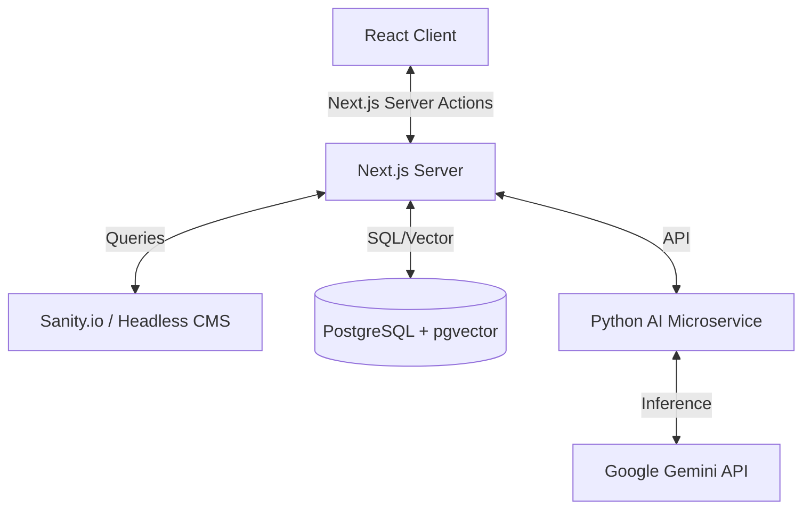

# Lumina | AI Digital Laboratory

> "The interface of the future is no interface at all. It is a seamless conversation between human intent and machine intelligence."


## 🌌 Project Overview

**Lumina** is a highly personalized personal brand website and digital laboratory designed for AI Engineers and Creative Developers. Unlike traditional portfolios, Lumina is built as a Progressive Web App (PWA) with a focus on "intent-based" interactions, immersive micro-animations, and a futuristic "Laboratory" aesthetic.

It currently serves as a high-fidelity frontend prototype, simulating AI interactions and demonstrating advanced UI/UX patterns suited for the AI era.

### ✨ Key Features

*   **Core Experience**
    *   **Bento Grid Layout**: A responsive, modular grid system for showcasing projects and stats.
    *   **Immersive Design**: Custom cursor physics, 3D tilt effects on cards, and noise texture overlays.
    *   **Dark/Light Mode**: Seamless theme transitions with persisted state.
    *   **Internationalization (i18n)**: Built-in support for English and Chinese (Simplified).

*   **Advanced Functionality**
    *   **Command Palette (`Cmd+K`)**: Keyboard-driven navigation system mimicking IDEs/Operating Systems.
    *   **Smart Interactions**: "Copy as Markdown" for blog posts, optimized for LLM sharing.
    *   **Visualizations**: Simulated typewriter effects for AI analysis and reading progress indicators.
    *   **Engagement**: Giscus (GitHub Discussions) integration, reaction systems, and scroll-triggered animations.

## 🛠️ Tech Stack (Frontend)

*   **Framework**: React 18 (SPA Architecture)
*   **Language**: TypeScript
*   **Styling**: Tailwind CSS + Typography Plugin
*   **Motion & 3D**: Framer Motion
*   **Icons**: Lucide React
*   **Routing**: React Router v6
*   **Utilities**: React Helmet Async (SEO), React Markdown, React Syntax Highlighter

## 🚀 Getting Started

1.  **Clone the repository**
    ```bash
    git clone https://github.com/your-username/lumina-portfolio.git
    cd lumina-portfolio
    ```

2.  **Install dependencies**
    ```bash
    npm install
    ```

3.  **Start the development server**
    ```bash
    npm start
    ```

4.  **Build for production**
    ```bash
    npm run build
    ```

## 🔮 Future Roadmap: Backend & AI Integration

The current version acts as a "View" layer. To transform Lumina into a fully functional "AI Laboratory," the following full-stack architecture is recommended.

### 1. The "Hybrid" Stack (Recommended)
*Goal: SEO performance + Real AI Capabilities*

*   **Meta-Framework**: Migrate from Vite/CRA to **Next.js (App Router)**.
    *   *Why*: Server-Side Rendering (SSR) is crucial for blog SEO. React Server Components (RSC) allow streaming AI responses directly from the server without exposing API keys.
*   **Database**: **PostgreSQL** (via Supabase or Neon).
    *   *Why*: Robust relational data for posts/projects. Easy integration with **pgvector** for storing embeddings (Vector Search functionality).
*   **CMS**: **Sanity.io** or **Strapi (Headless)**.
    *   *Why*: Managing content via Markdown files (current state) scales poorly. A Headless CMS allows for a rich editing experience.

### 2. The AI Engine (Backend)
*Goal: True GenAI features (e.g., "Chat with my Resume", "AI Project Analysis")*

*   **Language**: **Python (FastAPI)**.
    *   *Why*: Python is the native language of AI.
*   **Orchestration**: **LangChain** or **LlamaIndex**.
*   **Model Provider**: **Google Gemini API** (via `@google/genai` SDK).
    *   *Integration*: The frontend sends a prompt -> Next.js API Route -> FastAPI Service -> Gemini -> Stream back to Client.

### 3. Proposed Architecture Diagram



## 📁 Project Structure

```
lumina/
├── public/              # Static assets (Manifest, Icons)
├── src/
│   ├── components/      # Reusable UI components (BentoGrid, CommandMenu, etc.)
│   ├── pages/           # Route views (Home, Projects, Insights...)
│   ├── services/        # Data fetching & Mock services
│   ├── types/           # TypeScript definitions
│   ├── constants.ts     # Configuration & Translations
│   ├── index.css        # Tailwind directives & Global styles
│   └── App.tsx          # Main entry & Routing logic
├── package.json
├── tailwind.config.js
└── tsconfig.json
```

## 🎨 Customization Guide

*   **Content**: Edit `src/services/content.ts` to update projects, posts, and tools data.
*   **Translations**: Update dictionaries in `src/constants.ts`.
*   **Comments**: Configure your `repoId` and `categoryId` in `src/components/Comments.tsx` to enable Giscus.

---

Designed & Engineered by **Lumina**.
*Observations on the intersection of design, engineering, and artificial intelligence.*
