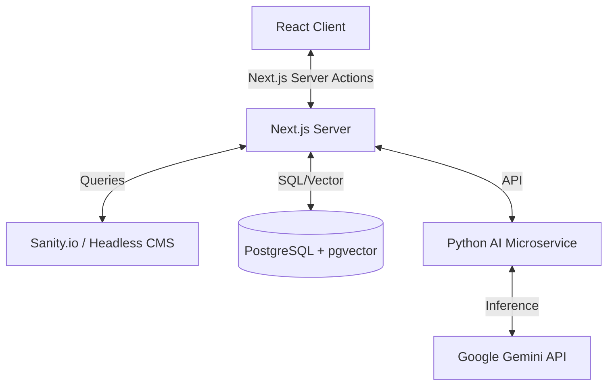

# Lumina | AI 数字实验室

> "未来的界面即无界面。它是人类意图与机器智能之间的无缝对话。"

[](./README.md)


## 🌌 项目概览

**Lumina** 是专为 AI 工程师和创意开发者设计的极具个性化的个人品牌网站与数字实验室。与传统的作品集不同，Lumina 被构建为一个渐进式 Web 应用 (PWA)，专注于探索“基于意图”的交互模式、沉浸式微动画以及充满未来感的“实验室”美学。

当前版本作为一个高保真的前端原型，模拟了 AI 交互流程，并展示了适合 AI 时代的先进 UI/UX 模式。

### ✨ 核心特性

*   **核心体验**
    *   **Bento Grid 布局**: 响应式、模块化的网格系统，用于优雅地展示项目和数据统计。
    *   **沉浸式设计**: 自定义光标物理效果、卡片 3D 倾斜视差、以及噪点纹理覆盖。
    *   **深色/浅色模式**: 丝滑的主题切换体验，支持状态持久化。
    *   **国际化 (i18n)**: 内置中英文双语支持，一键切换。

*   **进阶功能**
    *   **命令面板 (`Cmd+K`)**: 模拟 IDE/操作系统的键盘驱动导航系统，提升极客体验。
    *   **智能交互**: 博客文章支持“复制为 Markdown”功能，专门优化用于与 LLM 分享上下文。
    *   **可视化效果**: 模拟 AI 分析的打字机效果，以及环形阅读进度指示器。
    *   **互动与反馈**: 集成 Giscus (GitHub Discussions) 评论系统，点赞互动及滚动触发动画。

## 🛠️ 技术栈 (前端)

*   **框架**: React 18 (SPA 架构)
*   **语言**: TypeScript
*   **样式**: Tailwind CSS + Typography 插件
*   **动画 & 3D**: Framer Motion
*   **图标**: Lucide React
*   **路由**: React Router v6
*   **工具库**: React Helmet Async (SEO), React Markdown, React Syntax Highlighter

## 🚀 快速开始

1.  **克隆仓库**
    ```bash
    git clone https://github.com/your-username/lumina-portfolio.git
    cd lumina-portfolio
    ```

2.  **安装依赖**
    ```bash
    npm install
    ```

3.  **启动开发服务器**
    ```bash
    npm start
    ```

4.  **构建生产版本**
    ```bash
    npm run build
    ```

## 🔮 未来路线图：后端与 AI 融合

当前版本主要作为“视图 (View)”层。为了将 Lumina 转变为功能完备的“AI 实验室”，建议采用以下全栈架构方案：

### 1. "混合" 架构 (推荐)
*目标：SEO 性能 + 真实的 AI 能力*

*   **元框架**: 从 Vite/CRA 迁移至 **Next.js (App Router)**。
    *   *理由*: 服务端渲染 (SSR) 对博客 SEO 至关重要。React 服务端组件 (RSC) 允许直接从服务器流式传输 AI 响应，而无需暴露 API 密钥。
*   **数据库**: **PostgreSQL** (通过 Supabase 或 Neon)。
    *   *理由*: 为文章/项目提供强大的关系型数据支持。易于集成 **pgvector** 以存储嵌入向量 (实现向量搜索功能)。
*   **CMS**: **Sanity.io** 或 **Strapi (Headless)**。
    *   *理由*: 仅通过 Markdown 文件管理内容 (当前状态) 难以扩展。Headless CMS 能提供丰富的编辑体验。

### 2. AI 引擎 (后端)
*目标：真正的 GenAI 特性 (例如："与我的简历对话"、"AI 项目代码分析")*

*   **语言**: **Python (FastAPI)**。
    *   *理由*: Python 是 AI 领域的原生语言，生态丰富。
*   **编排框架**: **LangChain** 或 **LlamaIndex**。
*   **模型提供商**: **Google Gemini API** (通过 `@google/genai` SDK)。
    *   *集成方式*: 前端发送提示词 -> Next.js API 路由 -> FastAPI 微服务 -> Gemini -> 流式返回给客户端。

### 3. 建议架构图



## 📁 项目结构

```
lumina/
├── public/              # 静态资源 (Manifest, 图标)
├── src/
│   ├── components/      # 可复用 UI 组件 (BentoGrid, CommandMenu 等)
│   ├── pages/           # 路由页面 (Home, Projects, Insights...)
│   ├── services/        # 数据获取 & Mock 服务
│   ├── types/           # TypeScript 类型定义
│   ├── constants.ts     # 配置与翻译字典
│   ├── index.css        # Tailwind 指令 & 全局样式
│   └── App.tsx          # 主入口 & 路由逻辑
├── package.json
├── tailwind.config.js
└── tsconfig.json
```

## 🎨 定制指南

*   **内容管理**: 编辑 `src/services/content.ts` 以更新项目、文章和工具数据。
*   **多语言翻译**: 更新 `src/constants.ts` 中的字典。
*   **评论系统**: 在 `src/components/Comments.tsx` 中配置您的 `repoId` 和 `categoryId` 以启用 Giscus。

---

Designed & Engineered by **Lumina**.
*Observations on the intersection of design, engineering, and artificial intelligence.*
